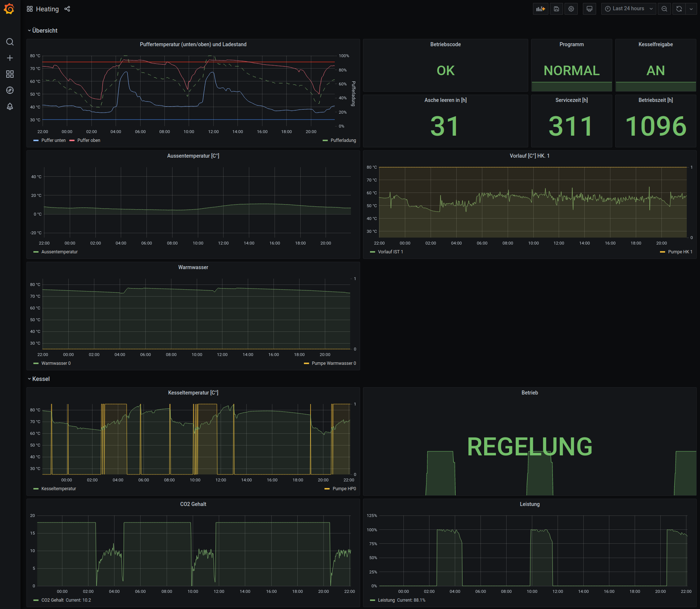

<a href="https://gitpod.io/#https://github.com/geropl/guntamatic"></a>

# What this is

This is a tiny Rust library and cli to connect to [Guntamatic](https://www.guntamatic.com/) devices via HTTP (modbus is planed but not started yet).

```sh
guntamatic 0.1.0
Gero Posmyk-Leinemann <gero.posmyk@posteo.de>
CLI tool to connect to and extract data from Guntamatic Devices

USAGE:
    guntamatic [FLAGS] <SUBCOMMAND>

FLAGS:
    -h, --help       Prints help information
    -v, --verbose    Controls the log level. ex.: -v,  -vv or -vvv
    -V, --version    Prints version information

SUBCOMMANDS:
    help    Prints this message or the help of the given subcommand(s)
    web     Accessing devices using web/HTTP APIs
```

The cli allows to:
 - `get`: read the current system state once
 - `stream`: read the current system state regularly and pump it into a data sink (currently [influxdb v2.0](https://docs.influxdata.com/influxdb/v2.0/) only)

Example command:
```sh
cargo run web <device IP> <API key> stream influxdb <url> <token> <bucket> <org>
```


Last but not least there is an example Grafana dashboard for a PowerChip heating (the only device this code has been tested with so far): 

# How to build

```sh
cargo build --release
```

Should give you a 

# How to Contribute

Easiest is to use https://www.gitpod.io: [](https://gitpod.io/#https://github.com/geropl/guntamatic)